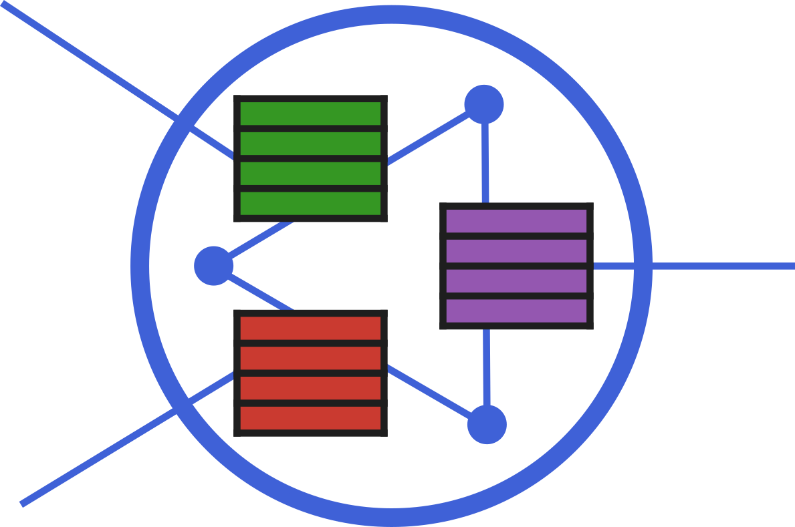

#  AlgebraicRelations.jl

[](https://AlgebraicJulia.github.io/AlgebraicRelations.jl/stable)
[](https://AlgebraicJulia.github.io/AlgebraicRelations.jl/dev)
[](https://codecov.io/gh/AlgebraicJulia/AlgebraicRelations.jl)
[](https://github.com/AlgebraicJulia/AlgebraicRelations.jl/actions/workflows/julia_ci.yml)


AlgebraicRelations.jl is a Julia library built to provide an intuitive and
elegant method for generating and querying a scientific database. This
package provides tooling for defining database schemas,
generating query visualizations, and connecting directly up to a PostgreSQL
server. This package is built on top of
[Catlab.jl](https://github.com/AlgebraicJulia/Catlab.jl) which is the
powerhouse behind its functions.

## Learning by Doing

The functions of this library may be best explained by showing an example
of how it can be used. This will be done in the steps of [Defining a
Schema](#defining-a-schema), [Creating Queries](#creating-queries), and
[Connecting to PostgreSQL](#connecting-to-postgresql).

### Defining a Schema

Within this library, we define database schemas based on the _presentation_ of a
workflow (more generally, the presentation of a symmetric monoidal category).
The presentation of a workflow includes the **data types** of products in the
workflow (objects in an SMC) and the **processes** that transform these products
(homomorphisms in an SMC). We will give an example of defining the schema of a
traditional computer vision workflow. This involves extracting images from a
file, performing a test/train split on images, training a neural network on
images, and finally evaluating a network on images. This example is also
presented in [this notebook](examples/ml_workflow_demo/ml_demo.ipynb).

#### Defining Types

In order to define types for the presentation, we need to provide the name of
the type (e.g. `File` for compressed files of images) and then the Julia
datatype which can store this type (The filename can be stored uniquely as a
`String`). The definition of all types that we will need for our example is as
follows:

```julia
# Initialize presentation object
present = Presentation()

# Add types to presentation
File, Images, NeuralNet,
Accuracy, Metadata = add_types!(present, [(:File, String),
                                          (:Images, String),
                                          (:NeuralNet, String),
                                          (:Accuracy, Real),
                                          (:Metadata, String)]);
```

#### Defining Processes

To define processes that operate on these types, we need three pieces of
information. First, we need the name of the processes (`extract` for the
process that extracts images from files), the input types (`File` for the file
to extract) and the output types (`Images` for the images which were
extracted). The symbol `⊗` (monoidal product) joins two types, allowing for multiple types
in the inputs and outputs of processes. To the schema, this means nothing more than that,
for the process `train` there are two objects need for the input, the first of
type `NeuralNet` and the second of type `Images`.

```julia
# Add Processes to presentation
extract, split, train,
evaluate = add_processes!(present, [(:extract, File, Images),
                                    (:split, Images, Images⊗Images),
                                    (:train, NeuralNet⊗Images, NeuralNet⊗Metadata),
                                    (:evaluate, NeuralNet⊗Images, Accuracy⊗Metadata)]);
```

#### Generating the Schema

Once this presentation is defined, the database schema can be generated as follows:

```julia
# Convert to Schema
@present_to_schema TrainDB(present);
print(generate_schema_sql(TrainDB()))
```

```sql
CREATE TABLE evaluate (NeuralNet1 text, Images2 text, Accuracy3 real, Metadata4 text);
CREATE TABLE extract (File1 text, Images2 text);
CREATE TABLE split (Images1 text, Images2 text, Images3 text);
CREATE TABLE train (NeuralNet1 text, Images2 text, NeuralNet3 text, Metadata4 text);
```

### Creating Queries

In order to create queries, we use the `@query` macro (based on the `@relation`
macro in Catlab). For this, we must specify a list of objects to get as results
of the query, list of all objects used in the query, and finally a list of
relationships between these objects (based on the primitives defined for the
workflow). In this case, the relationships between objects are the processes
from the presentation and the types of objects are the types defined in the
presentation. Following is an example workflow

```julia
q = @query TrainDB() (im_train, nn, im_test, acc, md2) where (im_train, im_test, nn,
                                                              nn_trained, acc, md,
                                                              md2, _base_acc, im) begin
    train(nn, im_train, nn_trained, md)
    evaluate(nn_trained, im_test, acc, md2)
    split(im, im_train, im_test)
    >=(acc, _base_acc)
end
print(to_sql(q))
```

This produces the following query:

```sql
SELECT t1.Images2 AS im_train, t1.NeuralNet1 AS nn, t2.Images2 AS im_test, t2.Accuracy3 AS acc, t2.Metadata4 AS md2
FROM train AS t1, evaluate AS t2, split AS t3
WHERE t2.NeuralNet1=t1.NeuralNet3 AND t3.Images2=t1.Images2 AND t3.Images3=t2.Images2 AND t2.Accuracy3>=$1
```

### Connecting to PostgreSQL

The connection to PostgreSQL is fairly straightforward. We first create a
connection using the [LibPQ.jl](https://invenia.github.io/LibPQ.jl/stable/)
library:

```Julia
conn = Connection("dbname=test_db");
```

We then can prepare statements and run them with arguments like:

```Julia
statement = prepare(conn,q)
execute(statement, [0.6])
```

which will obtain all of the rows from the previous query which contain
an accuracy of greater than 0.6.

The `execute` function will return a `DataFrame` object (from the
[`DataFrames.jl`](http://juliadata.github.io/DataFrames.jl/stable/) library)

## Theory

Some excellent resources for understanding how Bicategories of Relations relate
to SQL queries (and inspiriation for this library) are as follows:

- ["Knowledge Representation in Bicategories of Relations"](https://arxiv.org/abs/1706.00526)
  - This work does an excellent job of elucidating operations on the Bicategories of Relations and how that relates to methods of knowledge representation like SQL
- ["The operad of wiring diagrams: formalizing a graphical language for databases, recursion, and plug-and-play circuits"](https://arxiv.org/abs/1305.0297)
  - This work presents the concepts behind converting undirected wiring diagrams to queries (as well as the limitations present in this conversion)
- Category Theory for Scientists by Spivak
  - While generally a very useful introduction to Category Theory, this book elaborates on the categorization of databases in Chapter 3 (in the online version)
